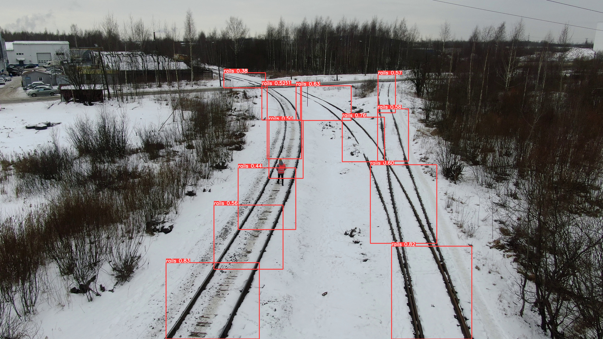
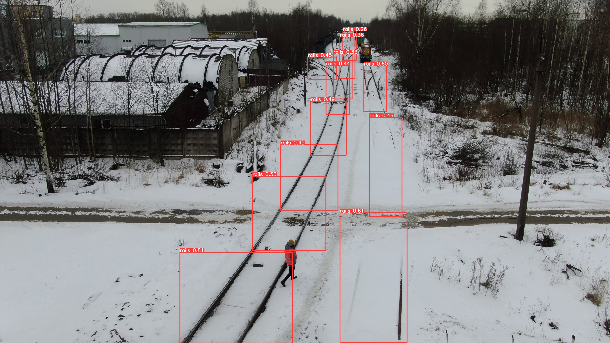
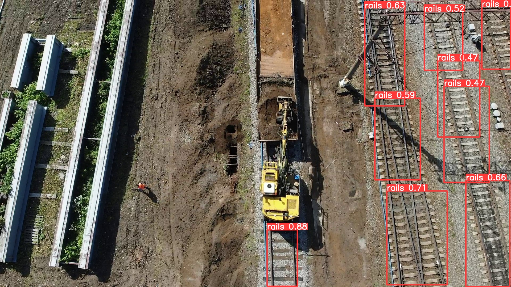
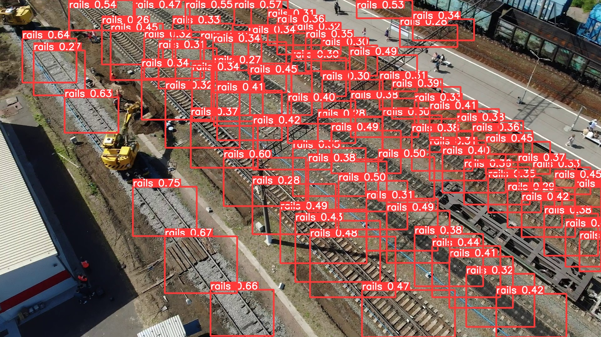
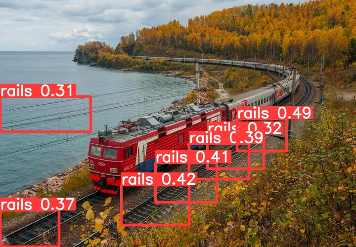
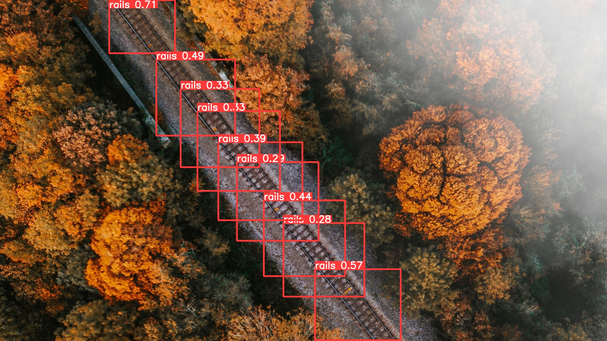
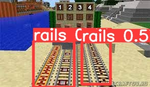

# Распознование рельс

## Структура репозитория
- [**custom_dataset_predictions**](custom_dataset_predictions) - результаты детекции объектов на собственном датасете с изображениями из открытых источников
- [**test_predictions**](test_predictions) - результаты детекции объектов на предоставленном тестовом датасете
- [**rails**](rails) - датасет с изображениями для обучения и тестирования модели ⚠️Из-за ограничений github директория train доступна только по [ссылке](https://drive.google.com/file/d/1mhP6q0X0iMoDgZlRkUwUfViH9rwh-5ZW/view?usp=sharing)⚠️
- [**yolov5**](yolov5) - исходный код модели, файлы конфигурации
- [**train_detect.ipynb**](train_detect.ipynb) - процесс обучения и использования модели
- [**cfg.yaml**](cfg.yaml) - файл конфигурации модели

## О задаче

В рамках тестового задания необходимо обнаружить на фото объект(Рельсы).

Обнаружение объектов в данном случае предпочтительнее сегментации из-за того, что необходима не детализированная информация о структуре объектов изображения, а определение наличия этих объектов и их местоположения.

Таким образом, данная модель может определять местоположение рельс на изображении и передавать их bounding box другим моделям для более тонкого анализа.

## Выбор модели
Для решения поставленной задачи не подходят стандартные методы обнаружения объектов. Например, при сравнении контуров (template matching) происходит подстройка алгоритма под конкретные изображения. Это может хорошо работать для однородных изображений из одного источника, но не подходит для работы с видеорядом окружающей среды.

Из оставшихся потенциальных решений оптимальным вариантом является использование нейросети. При этом, использование предобученной модели из схожей предметной области может компенсировать малое количество данных (1000 изображений) и ускорить процесс разработки (что актуально для тестового задания).

В качестве модели была выбрана **YOLO v5s**. Данная модель обучалась на датасете со схожей предметной областью объектов в окружающей среде (датасет Common Objects in Context) и является подходящим решением.
## Дополнительные действия над данными

YOLO v5 включает в себя встроенные средства работы с данными. Изначально, для того чтобы скомпенсировать небольшое кол-во изображений и улучшить точность и стабильность модели, изображения с вероятностью 0.5 отражались по горизонтальной оси и масштабировались.
Такая аугментация задавалась соответствующими параметрами в [файле конфигурации модели](cfg.yaml):

`
degrees: 0
scale: 0.5
flipud: 0
fliplr: 0.5
`

Остальные параметры (изменение цветов/насыщенности/вставка фрагментов) подбирались с помощью [эволюционного алгоритма](https://docs.ultralytics.com/yolov5/tutorials/hyperparameter_evolution/) на 300 поколениях и так же содержатся в [файле конфигурации](cfg.yaml).

В обучении модели задействованы все предоставленные изображения, а тестовая и обучающая выборки разбиты в отношении 30:70. 
Исходные файлы содержатся в директориях */images*, а их разметки в формате YOLO содержатся в директориях */labels*.

## Выбор метрики
Для оценки качества модели были выбраны метрики Precision и Recall. Данный выбор обусловлен тем, что они хорошо описывают именно обнаружение объектов на изображении, в то время как другие метрики (например mAP) больше концентрируются на попиксельном совпадении предсказанной рамки и разметки. 

Данная приоритезация была достигнута путем изменения весов метрик в функции *fitness* (yolov5/utils/metrics.py).
## Результаты

Финальные метрики на тестовом датасете: **precision - 0.56, recall - 0.59**.

Предсказания для всей тестовой выборки содержатся в директории [test_predictions](test_predictions)

Примеры детекции объектов на изображениях тестовой выборки:

Так же, для оценки переобученности модели был сформирован [собственный датасет](rails/test_2) со случайными изображениями из открытых источников. 

Данные изображения значительно отличаются от обучающей выборки разрешением, цветовой гаммой и ракурсами съемки.

Таким образом, при высокой переобученности, модель бы не смогла обнаружить на них объекты.

Как можно заметить, модель может с некоторой долей точности определять рельсы и на фото из других источников. Это свидетельствует об отсутствии явного переобучения и наличии некоторой обобщающей способности.
